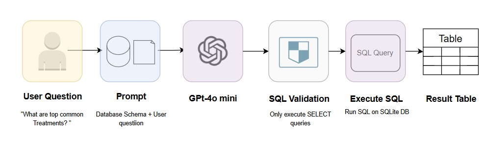
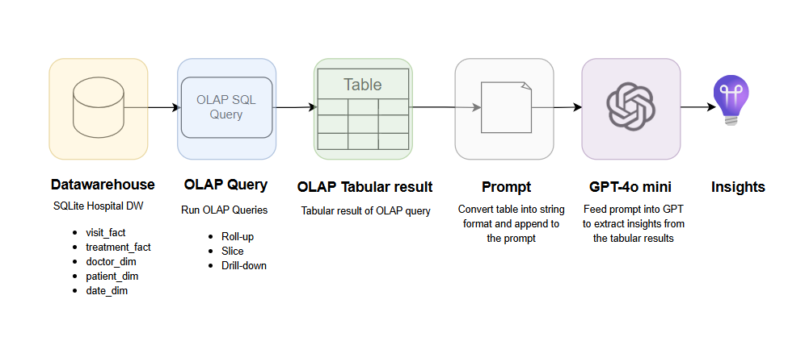
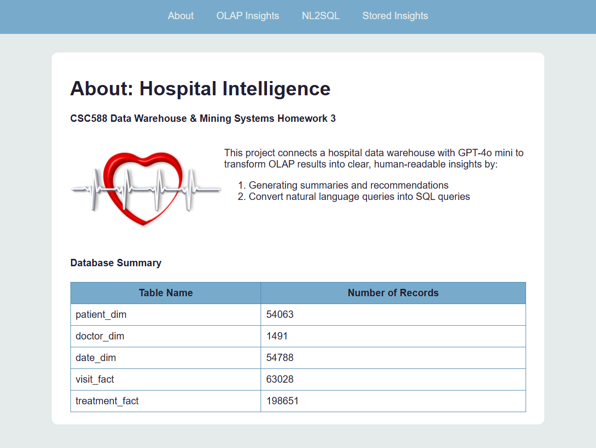
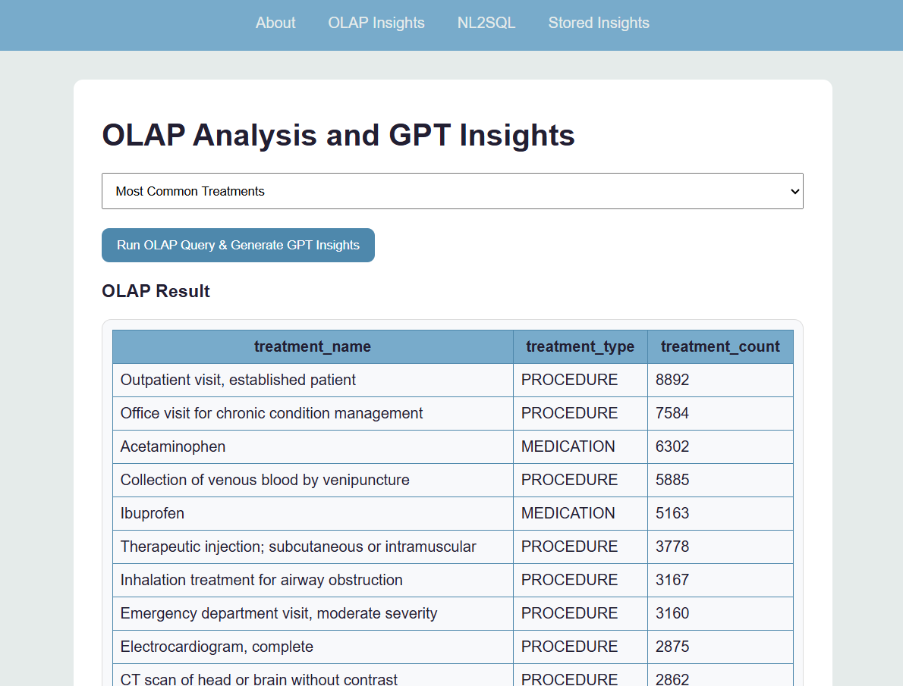
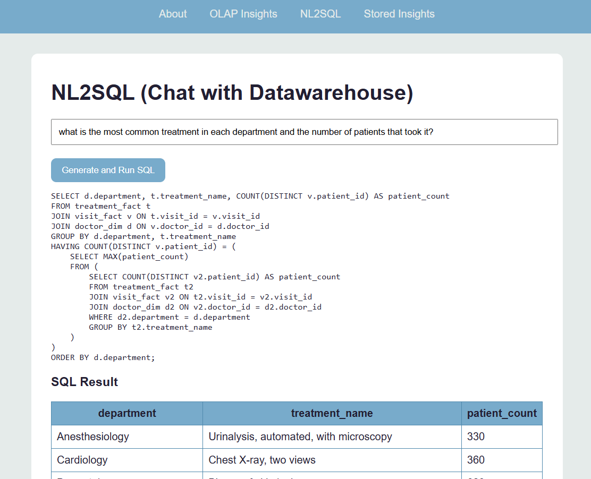
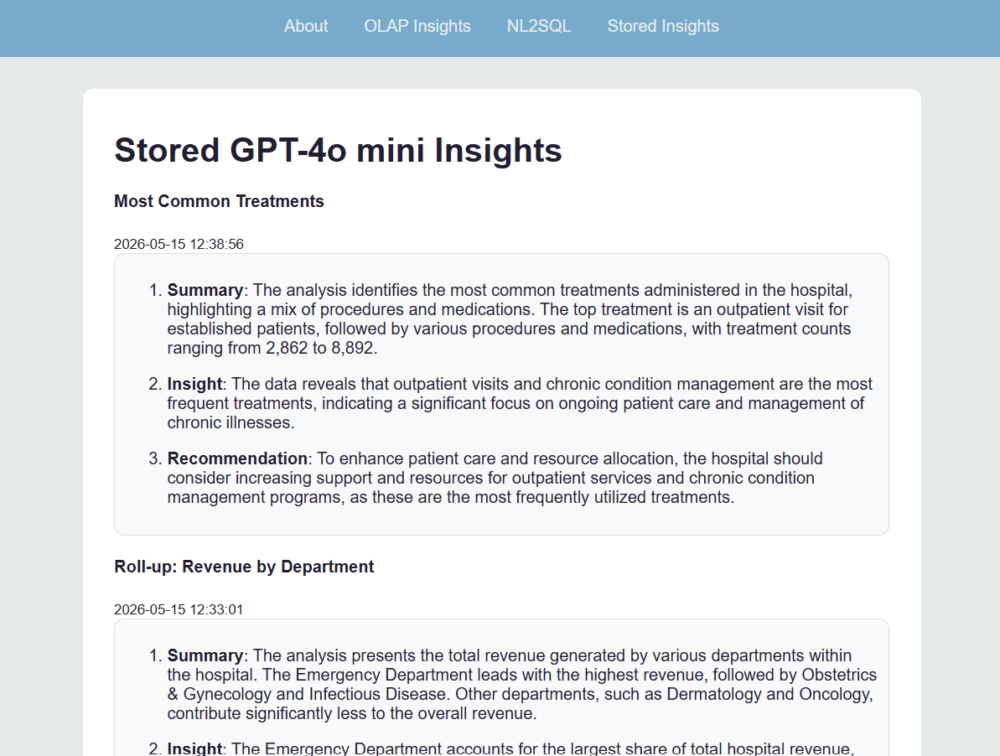

# Hospital Intelligence HWK3

A simple Flask application that connects a hospital data warehouse with GPT-4o mini. The system runs OLAP queries, generates GPT-based summaries, insights and recommendations as well as converts natural language queries into SQL, and stores these generated insights. You can download the data warehouse used from [kaggle](https://www.kaggle.com/datasets/ninamaamary/hwk3-hospital-data-warehouse) and a simple pipeline create [here](https://www.kaggle.com/code/ninamaamary/chat-with-hospital-db/)

# ⚠️ Environment Variables
create a .env file and add:
```
OPENAI_API_KEY=your_openai_api_key_here
DB_PATH=project.db
```
This step is important, the project will not work without it, to get the database download from [kaggle](https://www.kaggle.com/datasets/ninamaamary/hwk3-hospital-data-warehouse) and sign up to OpenAPI to get a key.

# Setup
```
conda create -n dw_gpt python=3.11 -y
activate dw_gpt
```

# Install requirements
```
pip install flask pandas openai python-dotenv tabulate
```

# Run Application
From project folder, run:
```
python app.py
```

# Pipeline
## NL2SQL


## OLAP Insights


# Application pages
## About Page
Show project introduction and table summary


## OLAP and GPT Insights
Runs predefined OLAP queries and generates DPT-based summaries, insights and recommendations


## Natural language to SQL (NL2SQL)
Converts natural language query into SQL and runs the generated `SELECT` query on the database.


## Stored Insights
Stores and displays GPT insights
